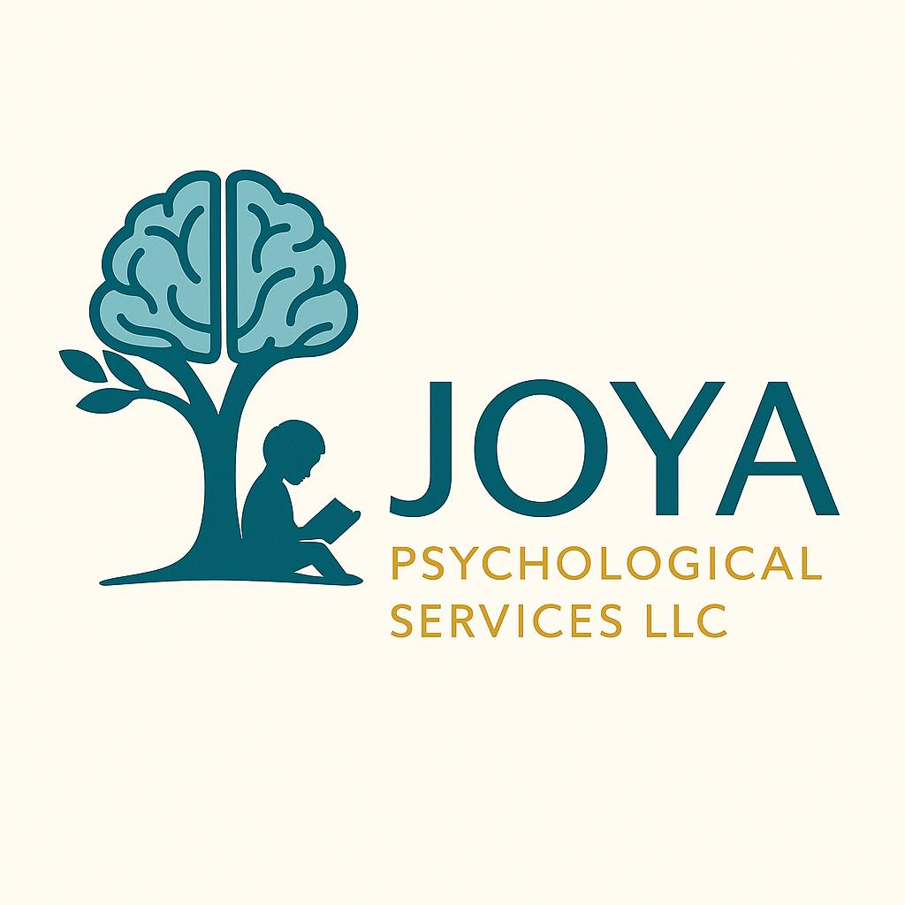

# Web Design Spec — JOYA Psychological Services LLC

## Brand Alignment

### Logo Colors
| Element | Color | Hex |
|---|---|---|
| "JOYA" text + tree/brain illustration | Deep teal | `#1A737B` |
| Brain detail / lighter canopy areas | Soft teal | `#6EC0D3` |
| "PSYCHOLOGICAL SERVICES LLC" tagline | Gold | `#C7A763` |
| Logo background | Cream | `#FCFBF5` |

### Current Site Colors
| Role | Current Hex | Named |
|---|---|---|
| Primary (headings, footer bg) | `#1B4965` | Dark blue |
| Accent (buttons, hover states) | `#62B6CB` | Light blue |
| Light accent (icon bg, card borders) | `#CAE9FF` | Warm blue |
| Background | `#FDFDFD` | Near white |
| Text | `#0A0A0A` | Near black |

### Recommended Unified Palette
The logo's teal is the brand's primary identity color. Shift the site palette gently toward it to create visual harmony without a jarring redesign.

| Role | New Hex | Notes |
|---|---|---|
| **Primary** | `#1A737B` | **Change** — Logo teal replaces `#1B4965`. Used for headings, footer background, hero gradient anchor. |
| **Accent** | `#6EC0D3` | **Tweak** — Logo lighter teal replaces `#62B6CB`. Very close shift (visible only side-by-side). Used for buttons, hover states, CTA backgrounds. |
| **Gold accent** | `#C7A763` | **New** — Logo gold. Use sparingly: secondary button outlines, divider accents, "see more" link underlines, decorative flourishes. |
| Warm light | `#CAE9FF` | Keep — still complementary alongside the new teal. |
| Background | `#FDFDFD` | Keep. Also adopt `#FCFBF5` (logo cream) as an option for the "Why Us" section background or card backgrounds to echo the logo backdrop. |
| Text | `#333333` | **Slight darken** from `#0A0A0A` → `#333333` for body copy readability (matching a softer, more professional tone). |

### Font Recommendations
**Keep current font stack** — it works well:
- **Headings:** Merriweather (serif, weight 700/900) — elegant and professional
- **Body:** Inter (sans-serif, weight 400/500/600) — clean, modern, excellent readability

**No font changes needed.** The logo uses a bold sans-serif for "JOYA" which Inter complements nicely, and the serif headings from Merriweather add the credibility expected of a psychological services firm.

---

## Logo Placement

### Header (Primary Location)
- **Position:** Left side of the fixed header bar, replacing the current text-only `.logo` div.
- **Container height:** 68px (current `header` height). Keep this.
- **Logo sizing:**
  - **Max height:** 44–48px (leaves 10–12px vertical padding inside the 68px header)
  - **Width:** auto (preserve original aspect ratio). The logo is roughly square-ish given the left-icon + right-text layout, so expect ~180–220px wide at 44px height.
  - **Do not crop or distort.** Maintain native proportions.
- **Text alongside:** **No** — the logo itself contains "JOYA" plus the tagline. Repeating text beside it would be redundant and clutter the header. Use the logo alone.

### Hero Section (Optional Secondary)
- Consider adding the logo (smaller, ~60px height) above the hero headline, or integrate the tree/brain icon as a subtle decorative element. **Not required** for this iteration — header placement is the priority.

### Favicon Recommendation
- Extract the tree/brain icon from the logo (crop the left ~40%) to produce a favicon + apple touch icon. File this as a follow-up task.

---

## Content Changes

### Site Name: "Joyous" → "JOYA"

The business is correctly branded as **JOYA Psychological Services LLC**. Every instance of "Joyous" must be updated.

| Location | Current Text | Change To |
|---|---|---|
| `<title>` tag | `Joyous Psychological Services LLC — Bilingual Evaluations` | `JOYA Psychological Services LLC — Bilingual Evaluations` |
| Header `.logo` div | `Joyous<br>Psychological Services LLC` | Replace entirely with logo image (no text) |
| Footer copyright | `&copy; 2026 Joyous Psychological Services LLC, Inc.` | `&copy; 2026 JOYA Psychological Services LLC` |
| File/folder name | `joyous-psych/` | Recommend renaming to `joya-psych/` or `joya-psychological/` for consistency (blocker: check if any external links point to the current path) |

### Copy Updates
- No other copy changes needed. The body content (services, why-us, hero) is all generic and does not reference the company name beyond the title and header/footer.

---

## Layout Changes

### Header Redesign

**Current structure:**
```html
<div class="logo">Joyous<br>Psychological Services LLC</div>
```

**New structure:**
```html
<a href="#" class="logo-link" aria-label="JOYA Psychological Services LLC home">
  
</a>
```

**CSS additions for the logo image in the header:**

```css
.logo-link {
  display: flex;
  align-items: center;
  text-decoration: none;
  height: 100%;
}
.logo-img {
  height: 44px;
  max-height: 44px;
  width: auto;
  display: block;
}
```

**Remove the old `.logo` rule** (the Merriweather-based text style) since it's no longer needed. The header layout (flexbox, `justify-content: space-between`) will continue to work with the image in place of the text.

### Color Updates Across the Site

| CSS Variable / Selector | Old Value | New Value |
|---|---|---|
| `--primary` | `#1B4965` | `#1A737B` |
| `--accent` | `#62B6CB` | `#6EC0D3` |
| *(new)* `--gold` | *(none)* | `#C7A763` |

**Specific impacted elements:**

1. **Hero gradient** — `var(--primary)` anchors the gradient; it will automatically pick up the new teal. The gradient `linear-gradient(160deg, var(--primary) 0%, var(--warm) 100%)` will shift subtly from dark-blue→warm to teal→warm. This is good — the teal is warmer and more inviting.

2. **Buttons** — `var(--accent)` background. Update hover state from `#4ba3b9` to `#5aaec4` (adjusting for the new accent hex).

3. **Footer background** — `var(--primary)` → `#1A737B`. The footer will shift from dark blue to teal. Consider adding the gold `#C7A763` for separator lines or link hover states in the footer for brand consistency.

4. **"Why Us" section background** — Currently `#F8FBFD`. Consider changing to `#FCFBF5` (logo cream) to visually connect the section to the brand palette.

5. **Gold accent usage (new):**
   - "See more services" link underline: change from `var(--accent)` to `var(--gold)`
   - `.service-card` border: add a subtle `1px solid rgba(199, 167, 99, 0.15)` option on hover
   - Hero CTA outline variant (future): a secondary gold outline button option

### Section Changes
- **No structural changes** to sections. The grid layouts, padding, spacing, and scroll animations all remain valid.
- The hero's `::before` overlay pattern can stay — it doesn't reference brand colors directly.

---

## Implementation Notes for Gilfoyle-WebBuilder

### 1. HTML Changes

**In `<head>` — update title:**
```html
<title>JOYA Psychological Services LLC — Bilingual Evaluations</title>
```

**In `<header>` — replace logo div with image:**
```html
<!-- BEFORE -->
<div class="logo">Joyous<br>Psychological Services LLC</div>

<!-- AFTER -->
<a href="#" class="logo-link" aria-label="JOYA Psychological Services LLC home">
  
</a>
```

**In `<footer>` — update copyright:**
```html
<p>&copy; 2026 JOYA Psychological Services LLC &middot; Made in Houston, TX.</p>
```

### 2. CSS Changes

**Update root variables:**
```css
:root {
  --primary: #1A737B;       /* was #1B4965 */
  --accent: #6EC0D3;        /* was #62B6CB */
  --gold: #C7A763;          /* NEW */
  --warm: #CAE9FF;          /* unchanged */
  --bg: #FDFDFD;            /* unchanged */
  --cream: #FCFBF5;         /* NEW (optional for section backgrounds) */
  --dark: #333333;          /* was #0A0A0A */
}
```

**Remove the `.logo` CSS rule entirely** (the old Merriweather text style).

**Add new CSS for `.logo-link` and `.logo-img`:**
```css
.logo-link {
  display: flex;
  align-items: center;
  text-decoration: none;
  height: 100%;
}
.logo-img {
  height: 44px;
  max-height: 44px;
  width: auto;
  display: block;
}
```

**Update button hover color:**
```css
.btn-signup:hover { background: #5aaec4; /* was #4ba3b9 */ }
.hero .btn-cta:hover { background: #5aaec4; }
.btn-cta-large:hover { background: #5aaec4; }
```

**(Optional) Update "Why Us" section background:**
```css
#why { background: var(--cream); }  /* was #F8FBFD */
```

**New gold accent for "See more" link:**
```css
.see-more a {
  border-bottom-color: var(--gold);  /* was var(--accent) */
}
.see-more a:hover { color: var(--gold); /* was var(--accent) */ }
```

### 3. Responsive Considerations

- **Desktop (≥769px):** Logo at 44px height sits comfortably in the 68px header.
- **Mobile (≤768px):** Header padding reduces to `0 1rem`. The logo image at 44px height is still fine. Verify the logo doesn't push nav items off-screen on very narrow viewports (<360px). If it does, reduce logo height to **36px** at the mobile breakpoint:

```css
@media (max-width: 768px) {
  .logo-img { height: 36px; }
}
```

- **Logo file:** `joya-logo.jpg` is 57KB. Consider converting to **WebP** (`joya-logo.webp`) for production to reduce load time, with the JPG as a fallback via `<picture>`. File this as a nice-to-have optimization.

### 4. Accessibility

- The `alt` text `"JOYA Psychological Services LLC"` on the header logo image satisfies WCAG.
- The `<a>` wrapper with `aria-label="JOYA Psychological Services LLC home"` adds screen reader context.
- Ensure the gold color `#C7A763` is used only for decorative/border elements, not for critical text or interactive elements where contrast ratio against light backgrounds (~2.7:1) is insufficient. The tagline on the logo itself is acceptable as part of a brand asset. For any new gold text on the site, use a darker gold such as `#B8944F` to meet WCAG AA contrast.

### 5. Change Summary Checklist

| # | Task | Priority |
|---|---|---|
| 1 | Replace text logo in header with `` tag | 🔴 Required |
| 2 | Update `<title>` to "JOYA Psychological Services LLC" | 🔴 Required |
| 3 | Update copyright in footer | 🔴 Required |
| 4 | Update CSS `--primary` to `#1A737B` | 🔴 Required |
| 5 | Update CSS `--accent` to `#6EC0D3` | 🔴 Required |
| 6 | Remove old `.logo` CSS rule | 🔴 Required |
| 7 | Add `.logo-link` and `.logo-img` CSS | 🔴 Required |
| 8 | Update button hover hex values | 🟡 Recommended |
| 9 | Update "See more" link to use gold accent | 🟡 Recommended |
| 10 | Add `--gold` and `--cream` CSS variables | 🟢 Nice-to-have |
| 11 | Shift "Why Us" section to cream background | 🟢 Nice-to-have |
| 12 | Mobile: reduce logo to 36px on narrow screens | 🟢 Nice-to-have |
| 13 | Rename folder from `joyous-psych/` to `joya-psych/` | ⚠️ Check external links first |
| 14 | Extract favicon from logo tree-brain icon | 🟢 Follow-up |
| 15 | Convert logo to WebP with JPG fallback | 🟢 Follow-up |

---

## Summary

This is a **medium-effort branding alignment** — approximately 30 minutes of implementation work (core changes: items 1–8). The visual outcome will be a site that clearly belongs to JOYA Psychological Services LLC, with a color palette that flows directly from the logo rather than competing with it. The teal + gold scheme is warm, trustworthy, and distinctive — appropriate for a practice serving families and children.